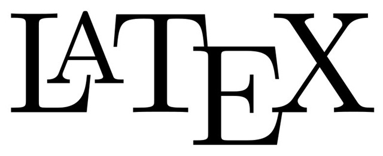
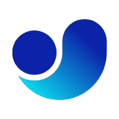
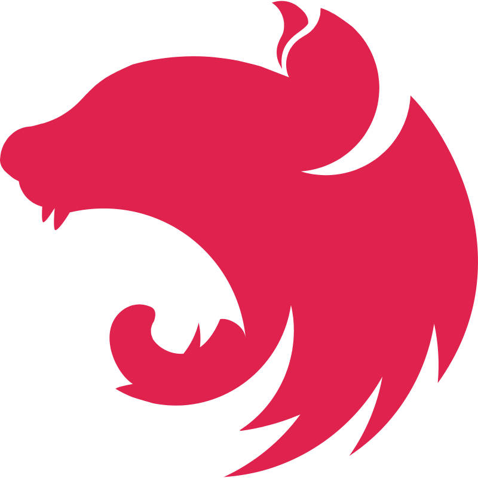
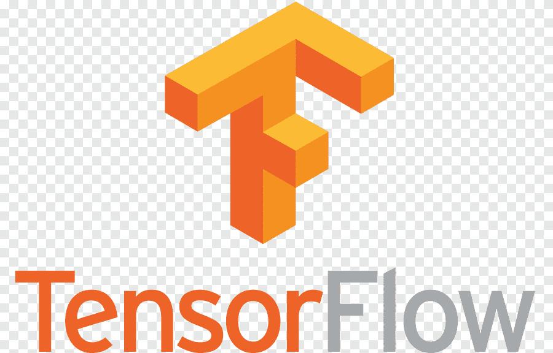

### Hi, I'm André Couto <!-- - aka [AndrewwMax][website] --> 👋

<!--  -->

## I am a Dreamer, Sportsman and Curious Developer!

I'm a dreamer, sportsman, curious developer

-   👨🏽‍🎓 Almost graduating in Computer Science
-   🔋 Interested in all good technology
-   👥 Learning and developing new ideas with friends
-   🌎 Improving the way you think about how the world works
-   🎨 Previous knowledge in Designer Art
-   📊 Very interested in UI/UX
-   🏋️‍♂️ Skills evolving

<!-- ### Connect with me:

[][website]
-->

 

### Languages and Tools:

[][skills]
[][skills]
[][skills]
[][skills]
[][skills]
[][skills]
[][skills]
[][skills]
[][skills]
[][skills]
[][skills]
[][skills]
[][skills]
[][skills]
[][skills]
[][skills]
[][skills]
[][skills]
[][skills]
[][skills]
[][skills]
[][skills]
[][skills]
[][skills]
[][skills]
[][skills]
[][skills]

<!-- [][skills] -->
<!-- [][skills] -->
<!-- [][skills] -->
<!-- [][skills] -->

 
 

<!-- [website]: https://andreww.dev.br -->

[skills]: Skill
